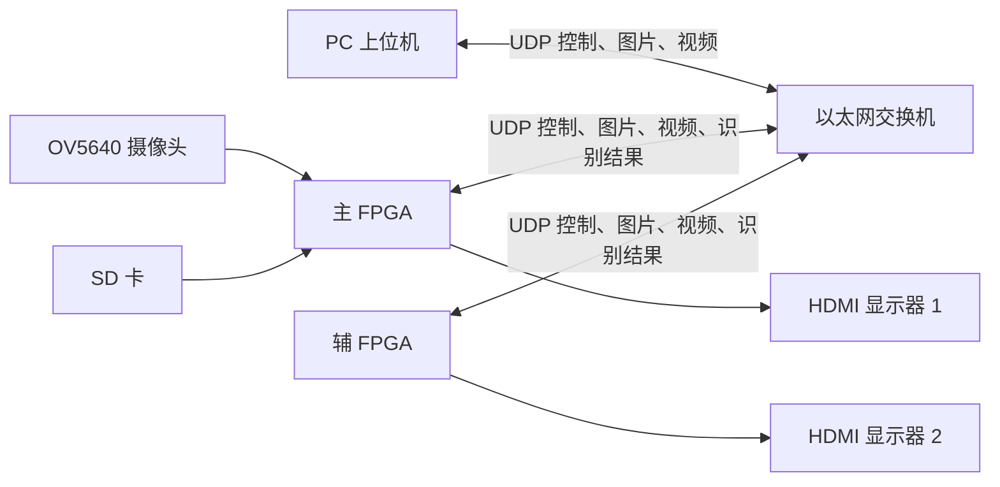

> [!NOTE] 归档与证据边界
> 2026-09-09 从 `C:/Users/22061/Desktop/HarmonyConnect_2025_安路赛题二_功能报告.md` 归档；原文件保留。本文为资料整理或 AI 辅助分析，性能与完成状态按正文原有证据日期理解，归档不代表项目进度更新。后续笔记维护以此库内版本为准。

# HarmonyConnect 2025 嵌赛 FPGA 赛道（安路赛题二）功能报告

## 一、报告范围

本报告根据本地参考作品视频和同目录 `info.json` 整理，目的在于梳理作品已经展示或明确说明的功能、数据流和性能指标。

本报告不是源代码审计。当前目录未发现该作品的 Vivado 工程、Verilog 源码、约束文件或综合报告，因此涉及内部模块名称、协议字段和时序实现的内容，只按照视频中能观察到的现象和说明进行描述。

### 资料信息

| 项目 | 内容 |
|---|---|
| 作品名称 | 2025 全国大学生嵌入式芯片与系统设计竞赛 FPGA 创新设计赛道（安路赛题二）国二作品 |
| 作品作者 | HarmonyConnect |
| 目标器件 | 安路 EG4S20BG256，20K 级 FPGA |
| 视频时长 | 约 4 分 48.8 秒 |
| 视频文件 | `D:\FPGA_Competition\嵌赛参考视频\视频\HarmonyConnect_2025嵌赛FPGA赛道（安路赛题二）国二作品\P01_2025嵌赛FPGA赛道（安路赛题二）国二作品.mp4` |
| 说明文件 | `D:\FPGA_Competition\嵌赛参考视频\视频\HarmonyConnect_2025嵌赛FPGA赛道（安路赛题二）国二作品\info.json` |

## 二、系统组成

作品由 PC 上位机、主 FPGA、辅 FPGA、OV5640 摄像头、SD 卡、以太网交换机和 HDMI 显示器组成。



主 FPGA 主要承担摄像头采集、SD 卡读写、网络收发、显示和系统控制；辅 FPGA 可以作为第二个网络节点，也可以承担 CNN 推理任务。

## 三、基础功能

### 1. PC 通过以太网 UDP 控制 LED 和数码管

PC 上位机向 FPGA 发送控制指令，FPGA 接收并解析 UDP 数据包，然后改变板上的 LED 和数码管状态。

```text
PC 上位机
  → UDP 控制指令
  → FPGA 网络接收
  → 指令解析
  → LED/数码管输出
```

这个功能建立了最小控制闭环，证明了上位机、以太网、FPGA UDP 接收逻辑和板上外设之间能够协同工作。它也是后续图片、视频和 CNN 结果传输的基础。

### 2. PC 向 FPGA 发送 RGB888 图片

PC 选择一张 RGB888 格式图片，通过 UDP 分包发送给 FPGA。FPGA 接收数据后重组图片，并通过 HDMI 显示。

该功能至少涉及以下处理：

- 上位机读取图片并组织发送数据；
- 图片数据拆分为多个 UDP 数据包；
- FPGA 接收并重组完整图片；
- 图片数据写入缓存；
- HDMI 从缓存读取并显示。

它验证了系统处理大于单个 UDP 数据包的数据流、进行帧级缓存和驱动显示输出的能力。

### 3. FPGA 从 SD 卡读取图片并发送到 PC

FPGA 从 SD 卡读取图片数据，再通过 UDP 发送到 PC 上位机，PC 接收后显示图片。

数据路径为：

```text
SD 卡 → FPGA 存储控制 → UDP 分包发送 → PC 接收重组 → 上位机显示
```

这个功能体现了 FPGA 的本地数据读取、图片帧组织、网络发送和 PC 端接收能力。视频中还展示了主 FPGA 接收辅 FPGA 发来的图片并显示，说明该图片传输链路可以在 FPGA 节点之间复用。

### 4. FPGA 通过 OV5640 采集视频并发送到 PC

主 FPGA 连接 OV5640 摄像头，接收摄像头输出的视频流，经过缓存或格式整理后，通过 UDP 连续发送给 PC 上位机。

```text
OV5640
  → 摄像头时序接收
  → 像素数据整理/缓存
  → UDP 连续分包
  → PC 上位机实时显示
```

相比单张图片，这项功能需要持续处理行同步、帧同步、连续像素流、帧边界和网络带宽。视频说明在 64 帧传输情况下，以太网带宽占用约为 240 Mbps，说明视频链路已经是系统的重要资源消耗。

## 四、双 FPGA 与多设备功能

### 5. 双 FPGA 之间通过 UDP 通信

作品使用两块 FPGA 板卡构建网络系统。辅 FPGA 可以在部分场景中替代 PC 上位机，接收主 FPGA 的控制命令和图像/视频数据。

视频展示了辅 FPGA 从 SD 卡读取图片并发送给主 FPGA，主 FPGA 接收后在 HDMI 显示器上显示。由此可见，系统的 UDP 通信对象不局限于 PC，也支持 FPGA 到 FPGA 的数据交换。

### 6. 切换 UDP 目标设备

主 FPGA 支持在 PC 上位机和辅 FPGA 之间切换发送目标。视频中通过板上按键切换目标设备，并展示了主 FPGA 向不同设备发送摄像头画面的过程。

这项功能可以理解为一个简化的多设备通信管理：

```text
摄像头视频
    → 主 FPGA
    → 目标选择逻辑
       ├── PC 上位机
       └── 辅 FPGA
```

作品总结页将此能力概括为“多设备以太网通信，一主多从”。

### 7. 网络中断后的传输恢复

视频对以太网进行了断线重连测试：先拔出网线，使数据传输中断，再重新插入网线，数据传输能够恢复。

这个功能证明系统具备一定的异常恢复能力。不过视频没有展示具体的超时、重试、状态机或缓存清理细节，因此只能确认演示层面的恢复效果，不能据此推断完整的协议实现方式。

## 五、CNN 汽车十分类功能

### 8. 主 FPGA 采集视频，辅 FPGA 执行 CNN

作品将摄像头采集和 CNN 推理解耦：主 FPGA 采集 OV5640 视频，经以太网发送给辅 FPGA；辅 FPGA 执行 CNN 识别，再将识别结果返回或显示。

```text
主 FPGA 采集摄像头
        ↓ UDP 视频
辅 FPGA 接收图像
        ↓
CNN 汽车十分类
        ↓
识别结果返回/显示
```

这种架构让一块 FPGA 负责数据流和外设，另一块 FPGA 专注神经网络计算，能够缓解单器件的逻辑、存储和 DSP 资源压力。

### 9. 纯 Verilog 部署 INT8 CNN

CNN 部分使用纯 Verilog 部署到 FPGA 中，而不是依赖 GPU 或软件推理框架。作品说明其网络以 MobileNetV1 为基础，并进一步进行了轻量化设计。

视频和说明文件给出的模型信息包括：

- 汽车图像十分类；
- INT8 量化；
- 验证集准确率约 80%；
- 参数量约 23210；
- INT8 权重存储量约 185 Kbit；
- 需要在 RTL 中实现卷积、激活、池化、权重存储和分类控制。

这部分工作本质上实现了一个小型专用神经网络处理单元。它要求把训练得到的模型转换成硬件可以执行的定点计算，并处理层间数据流、定点位宽和推理时序。

### 10. CNN 推理性能和资源占用

说明文件给出的性能和资源信息为：

| 指标 | 作品说明值 |
|---|---:|
| 时钟频率 | 50 MHz |
| 单次推理时间 | 5.46 ms |
| 理论推理帧率 | 180 帧/秒以上 |
| LUT | 约 9K |
| FF | 约 7K |
| BRAM | 约 40 个 M9K、12 个 M32K |
| DSP | 约 26 个，主要为 18×18 bit |
| UDP 与 CNN 同时运行时资源占用 | 超过 80% |

视频最后的系统总结页又显示完整识别流程约 30 帧/秒。两者应区分理解：5.46 ms 和 180 帧/秒更像是计算核心的单次推理时间和理论上限，30 帧/秒更可能包含摄像头采集、UDP 传输、缓存、显示和系统调度后的实际端到端帧率。报告中没有提供独立综合报告或完整测量脚本，因此这些数值应视为作品自述指标。

## 六、视频压缩与解压缩功能

### 11. RGB888 到 YUV420 的视频压缩

作品实现了 RGB888 视频到 YUV420 的转换，并在接收端恢复回 RGB888：

```text
RGB888 → YUV444 → YUV420 → 网络传输
网络接收 → YUV420 → YUV444 → RGB888
```

YUV420 通过降低 U、V 色度分量的采样密度来减少数据量，而保留更高精度的亮度 Y。由于人眼对亮度变化更敏感，这种方式可以在降低带宽的同时保持较好的视觉效果。

作品说明其压缩率约为 50%，并将其描述为视觉无损压缩。视频中的原理图明确展示了 RGB888、YUV444 和 YUV420 之间的正向压缩与反向恢复过程。

这项功能的工程价值在于：当原始 RGB888 视频占用的网络带宽过高时，可以先在 FPGA 中压缩，再通过 UDP 传输，从而降低网络压力。

## 七、功能闭环总结

这个参考作品已经形成了一个从控制、数据传输、视频采集到硬件 AI 推理的完整闭环：

```text
PC 控制 FPGA
    → 图片双向传输
    → 摄像头视频传输
    → 双 FPGA 协同
    → INT8 CNN 汽车识别
    → HDMI/LED/数码管交互
    → YUV420 压缩降低带宽
    → 断线重连提高稳定性
```

它的核心特点不是单独实现某一个 CNN 算子，而是把以太网通信、图像缓存、摄像头、显示、双 FPGA 协同和纯 Verilog CNN 集成到同一套可演示系统中。

## 八、对 AX7Z020 项目的借鉴边界

你的项目使用 ALINX AX7Z020，属于 Zynq-7000 SoC 平台；本参考作品使用安路 EG4S20BG256。两者在 FPGA 资源、DSP/BRAM 结构、以太网接口、摄像头引脚、时钟约束和工具链方面不同，因此不能直接照搬其工程文件、资源数据或时序结论。

可以借鉴的工程顺序是：

1. 先完成 UDP 控制闭环；
2. 再完成固定图片收发和 HDMI 显示；
3. 再完成 OV5640 或固定图像输入；
4. 独立验证 INT8 MAC 和 Python 黄金结果；
5. 再接入固定图像 CNN；
6. 最后扩展摄像头、视频传输、压缩和 PS/PL 交互。

对你当前项目最有价值的参考点是：先把数据传输和显示链路做成稳定闭环，再把 INT8 神经网络作为可测量的独立计算模块接入。参考作品的性能、资源和准确率只能作为设计目标参考，必须在 AX7Z020 上重新测量。

## 九、结论

HarmonyConnect 作品实现了 PC-FPGA UDP 控制、图片双向传输、OV5640 视频传输、双 FPGA 通信、目标设备切换、以太网断线恢复、纯 Verilog INT8 CNN 汽车十分类和 YUV420 视频压缩等功能，并通过 HDMI、LED、数码管和上位机完成了演示输出。

其中工作量最大的部分是将轻量化 CNN 从训练和量化结果转换为纯 Verilog 硬件推理链路；系统难点则集中在视频数据量、UDP 分包重组、缓存、双设备协同和器件资源约束之间的平衡。


## 归档导航

- [[02-项目/基于 AX7Z020 的低比特神经网络 FPGA 加速系统，实现摄像头手势识别并驱动板卡进行实时交互/项目总览|项目总览]]
- [[02-项目/基于 AX7Z020 的低比特神经网络 FPGA 加速系统，实现摄像头手势识别并驱动板卡进行实时交互/项目进程|项目实际进度（唯一状态入口）]]
