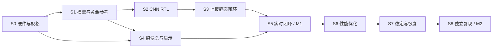

> [!NOTE] 归档与证据边界
> 2026-09-09 从 `D:/FPGA_Competition/report/plan_b_execution_and_acceptance.md` 归档；原文件保留。本文为资料整理或 AI 辅助分析，性能与完成状态按正文原有证据日期理解，归档不代表项目进度更新。后续笔记维护以此库内版本为准。

# B 方案实施与阶段验收计划

编制日期：2026-09-09，南京时间（UTC+8）  
项目：基于 AX7Z020 的低比特神经网络 FPGA 加速系统  
目标器件：xc7z020clg400-2  
主任务：握拳、手掌、数字一、数字二、数字三，共五类静态手势识别与板卡交互。

## 1. 最终交付什么

完成一套能在真实摄像头连续输入下运行的系统：PL 完成预处理和主要 INT8 CNN 计算，PS 管理任务、配置与结果，HDMI 显示图像和识别信息，至少一种板卡输出根据识别结果动作。系统能够处理无手、输入中断和计算异常，并提供可重复的准确率、性能、资源及优化证据。

固定图片版本是中间验收和故障定位工具，不能代替最终真实摄像头验收。HDMI 在接口核实后纳入默认最终范围；若硬件确实不支持，必须记录范围变更与替代显示方案，不能默认为已经完成 HDMI 功能。

整个任务分为 **9 个阶段：S0—S8**，设置两个版本里程碑：

- **M1 可演示基线：S0—S5 通过。** 五类模型、真实摄像头、PL 推理、PS 控制和显示/交互形成闭环；性能可以尚未达到强化目标，但必须有真实基线。
- **M2 B 完整强化版：S0—S8 全部通过。** 优化、鲁棒性、可配置、数据证据与独立复现均完成。

这两个名称是工程里程碑，不代表官方国二或国一资格。本文数值阈值是建议采用的项目验收标准，不是官方评分线。

## 2. 阶段总览与依赖

| 阶段 | 核心任务 | 阶段结束必须拿得出的结果 | 对应原功能 |
|---|---|---|---|
| S0 硬件与验收规格冻结 | 确认板卡、接口、工具、模型和测量口径 | 可下载启动的板卡＋确定的接口与验收规格 | 全部功能前置 |
| S1 数据集与整数模型 | 完成五类训练、量化和黄金参考 | 可复现五类 INT8 模型＋逐层黄金数据 | F2、F9、F11 |
| S2 RTL 算子与整网 | 实现完整主要计算及共享控制 | 在仿真中逐层对齐的 CNN RTL | F2、F4、F10 |
| S3 PS/PL 静态图闭环 | 打通寄存器、存储和上板推理 | 固定图片在板上得到正确五类结果 | F5、F6、F11 |
| S4 摄像头与显示链路 | 打通真实图像、预处理和 HDMI | 实物图像可持续显示，模型输入可核对 | F1、F7 |
| S5 实时交互基线 | 合并采集、CNN、显示和板卡动作 | 不依赖人工换图的完整演示；冻结 M1 | F1、F6、F7、F11 |
| S6 数据流与性能优化 | 基线对照、缓存复用、流水/并行优化 | 可重复的优化收益和资源代价 | F2、F3、F4、F11 |
| S7 配置、鲁棒性与恢复 | 验证配置、未知输入、异常和稳定性 | 功能与异常测试全部有闭环记录 | F5、F8、F9、F11 |
| S8 独立复现与提交 | 重建、整理 Skill、AI 记录和材料 | 他人按文档重建并复现核心结果；冻结 M2 | F10、F12及全部材料 |



S4 的接口验证可在模型/RTL 开发期间穿插进行。黄金参考、日志、构建脚本、AI 记录从第一阶段开始保存，不等到 S8 才补写。S7 的状态机设计也应在 S3 提前实现，S7 负责整机验收。

## 3. 每阶段通用的完成规则

每阶段建立一份验收记录，状态只能为：未开始、进行中、阻塞、通过、未通过。

**只有以下四项同时满足，才能标记“通过”：**

1. 本阶段列出的硬性完成判据全部满足；失败项不能用演示视频覆盖。
2. 每条判据都对应原始记录和运行条件，能找到输入、版本与测试方法。
3. 阶段报告中的结论与实际日志一致，截图不代替原始数据。
4. 新改动没有破坏已通过的受影响功能，相关回归通过。

无法达到强化指标时，可保存为“功能通过、强化指标未通过”，但该阶段总体仍不能计入 M2 完成。若修改验收范围，应说明原因、影响和版本；不能为通过测试而事后悄悄降低标准。

本计划只定义执行与验收，不代表阶段已经完成。目前已知是基础 RTL 与 Python INT8 参考起步状态，需从 S0 重新核对证据；已有有效证据可以复用，不必无意义重做。

## 4. S0：硬件与验收规格冻结

### 要做什么

- 核对核心板/底板型号、PCB 版本、芯片、DDR、下载接口、用户 LED 与按键。
- 确认摄像头模组是 DVP 还是 MIPI、连接器、电平、供电、时钟和配置接口。
- 核对 HDMI 输出电路、引脚和必要器件；建立引脚来源表，禁止猜引脚。
- 固定工具版本、启动方式及 PS/PL 分工；先做 UART/LED 和必要 DDR 自检。
- 定义输入预处理、五类标签、输出动作、帧号、超时和测量边界。
- 固定资源上限与强化指标，列出暂无法确定的参数及其关闭条件。

### 怎样确认完成

- 至少完成一次重新上电、下载/启动和 UART/LED 自检，保留完整日志。
- 后续会使用的每个接口都有对应原理图/手册依据、引脚、电平与时钟来源。
- 使用 DDR 的方案通过明确地址范围的写读比对，记录容量、模式、次数和零错误结果。
- 工程器件与实物一致；不存在阻碍采集、推理、显示的关键未知接口。
- 验收规格有明确版本，不能仍以“AXI 或其他”“HDMI 或其他”作为所有接口的最终定义。

### 证明与材料

- `board/hardware_inventory.md`：板卡与外设清单、实物照片索引、接线。
- `board/interface_map.md`：端口、引脚、IOSTANDARD、时钟、文档页码。
- `report/acceptance_spec.md`：模型范围、显示/动作、性能与测量标准。
- `report/evidence/s0/`：启动、下载、DDR/LED/UART 自检日志与照片。

### 卡住时如何处理

摄像头缺件时可以继续 S1/S2，以及不依赖该接口的 S3 工作；S0 记录阻塞，S4 和最终 M2 不能通过。软件不能替代电气确认；实物接线和可观察测试需要板卡可访问或现场反馈。

## 5. S1：数据集、浮点模型与 INT8 黄金参考

### 要做什么

- 固定五类标签与训练/验证/测试划分，优先按人员、采集会话分割，防止相邻视频帧泄漏。
- 固定 32×32 灰度输入的裁剪、缩放、灰度、归一化和整数映射规则。
- 明确每层卷积核、通道、stride、padding、池化和 FC 形状，计算权重、激活、MAC 数。
- 完成浮点训练与 INT8 量化；明确零点、scale、舍入、饱和、偏置与逐层累加位宽。
- 输出独立整数参考与逐层输入/输出；测量合理优化的 ARM 推理基线，最迟在 S6 前补齐板上基线。

### 怎样确认完成

- 从固定权重、输入与环境能够重复生成一致的 INT8 输出；不要求跨平台训练过程逐位一致。
- 每层有完整维度与位宽说明，特别是累加上界；不能将四项点积的 18-bit 累加器直接推广到整网。
- 测试集无已知训练泄漏；建议至少 1,000 个独立测试样本、五类各 200 个，报告人员/会话组成。
- 为完整强化目标，INT8 测试集准确率达到 90%，相对浮点下降不超过 2 个百分点；若未达到，可进入硬件调试，但 S1 强化验收保留未通过。
- 保存混淆矩阵、逐样本预测及 Macro-F1。90% 是点估计，不宣称真实总体准确率必定高于 90%。

### 证明与材料

- `data/dataset_manifest.json`：来源、使用许可/授权情况、划分、标签与样本哈希。
- `report/model_spec.md`：完整层表、参数量、MAC 数、预处理和量化规则。
- `data/model/`：浮点/INT8 权重、偏置、scale、标签和哈希。
- `sim/golden/`：固定样本逐层整数输入/输出。
- `report/evidence/s1/`：训练/量化配置、测试集逐样本结果、混淆矩阵、统计报告。

### 卡住时如何处理

准确率不足优先检查划分、预处理、类别样本和量化误差；不能调整测试集来提高成绩。数据或模型变化必须提升版本，并使受影响黄金数据和下游验证失效重验。

## 6. S2：RTL 算子与完整 CNN 仿真

### 要做什么

- 先实现 INT8 MAC、舍入/饱和，再实现卷积、激活、池化和 FC。
- 明确共享 MAC 阵列、权重与激活 BRAM 布局、层控制和忙闲状态。
- 为每层提供可导出的中间结果，用 S1 的整数参考进行比对。
- 加入随机有效/等待节拍、存储器延迟、复位和边界输入测试。
- 对实际 CNN 顶层进行综合、资源和时序初查，不沿用基础 ROM 工程的结果。

### 怎样确认完成

- 所有实现算子在定义测试集内零数值不匹配，覆盖 -128/127、正负累加、舍入中点、饱和、padding 和窗口边界。
- 建议每个算子至少 1,000 组定向/随机组合；完整网络至少 100 个覆盖五类的输入逐层逐值一致。
- 握手停顿与复位测试通过，不依赖理想“每拍一直有效”的条件。
- 综合无错误、无非预期锁存器；资源能够容纳，目标时钟风险有明确报告。
- 完整主要计算在 RTL 中运行；只有 MAC 正确不能标记此阶段完成。

### 证明与材料

- `src/rtl/`：算子、缓存、层控制和顶层源码。
- `sim/`：测试台、调用脚本、种子、测试配置和差异报告。
- `report/evidence/s2/`：完整仿真日志、典型波形、逐层比对与综合报告。
- `report/rtl_architecture.md`：数据流、状态机、缓存地址规划和周期预算。

### 卡住时如何处理

优先用单层、单通道、最小输入定位，先保证整数行为正确再增加并行度。仿真失败不进入“硬件结果一定正确”的整机验收，但可继续独立摄像头工作。

## 7. S3：PS/PL 静态图片上板闭环

### 要做什么

- 定义输入/输出、任务编号、start/busy/done/error 和超时寄存器。
- 根据数据规模选择共享 BRAM 或 DMA；数据搬运与控制寄存器分开设计。
- PS 加载真实模型输入和权重，启动 PL 并读取输出，不使用伪造类别或软件结果冒充 PL。
- 实现缓存所有权、必要 Cache flush/invalidate、地址对齐、结果确认与复位恢复。
- 对最终使用的 PS/PL 顶层布局布线、生成位流并上板测试。

### 怎样确认完成

- 至少 100 个覆盖五类的固定样本，板上输出 logits/整数分数与黄金参考完全一致，而不只检查 argmax。
- 连续执行至少 1,000 次任务，无丢任务、重复结果或死锁；输入与结果通过 task_id 对应。
- 空闲/忙时重复启动、非法参数和复位均有规定响应，恢复后可完成新任务。
- 已约束的必要时钟与 IO 检查完整，布局后 setup/hold 均满足，TNS/THS 为零；例外约束有真实依据，不能用 false path 掩盖错误。
- 保存的是实际 CNN 整机顶层报告与位流，不是测试小模块的时序结果。

### 证明与材料

- `report/register_map.md`：寄存器、地址、状态、错误码与任务时序。
- `src/ps/`：启动、搬运、读取、超时和配置软件。
- `board/constraints/`：本轮有效 XDC 与引脚依据。
- `report/evidence/s3/`：串口原始日志、板上逐样本比对、ILA 关键波形、时序/CDC/DRC 与资源报告。
- `build/releases/static_baseline/`：阶段源码清单、构建信息、位流/启动文件和哈希清单。

## 8. S4：摄像头、预处理与 HDMI

### 要做什么

- 按 S0 核实接口实现摄像头接收、像素整理和跨时钟缓冲。
- 先用色条/测试图验证显示，再将摄像头接入显示链。
- 明确原始视频尺寸与 CNN 32×32 输入是不同数据格式；规划帧缓存和行缓存。
- 实现与训练一致的裁剪、灰度、缩放和定点化，导出实际送入 CNN 的输入。
- 建立帧号、完整帧标志、有效像素计数和丢帧计数。

### 怎样确认完成

- 色条、方向、颜色/灰度和显示时序正确，无持续花屏或撕裂。
- 摄像头连续运行至少 30 分钟，无输入/显示死锁；每帧像素数和格式合法。
- 抽取至少 100 帧，将硬件预处理输出与同一原始帧的软件参考逐值比较；若选择近似算法，必须事先定义容差并使训练/黄金流程采用同一算法。
- 输入帧率、有效帧率、丢帧率有真实记录。允许设计性降帧，但必须计数，不得静默丢失。
- CDC 检查完成；不能仅用“屏幕能亮”判定采集和预处理正确。

### 证明与材料

- `report/video_pipeline.md`：时钟域、格式、帧缓存、丢帧和显示策略。
- `report/evidence/s4/`：色条/实物视频、帧统计、原始帧和对应 32×32 输入、比对日志、摄像头配置版本。
- 必要的同步信号/像素链路波形及问题排查记录。

## 9. S5：真实输入到交互输出，冻结 M1

### 要做什么

- 合并 S3/S4：摄像头→预处理→PL CNN→PS→HDMI/LED 或已选动作。
- 用 frame_id 关联画面和结果，明确“显示当前画面＋最近结果”还是“延迟画面与结果严格同步”。
- 显示类别、分类分数、状态和实测帧率；未做概率校准时不把原始分数写成可信概率。
- 加入基础无手/未知抑制、动作去抖或冷却机制，避免每帧重复触发。
- 测量核心延迟、端到端延迟、有效结果 FPS 和丢帧，形成优化前基线。

### 怎样确认完成

- 五类手势都能通过真实摄像头输入并驱动规定输出；无需手动加载图片或伪造结果。
- 进行至少 50 次预先定义的交互尝试，每类至少 10 次，记录所有成功与失败；M1 工程门槛建议成功率至少 80%。该样本不能替代 S1 独立准确率测试。
- 连续运行至少 30 分钟，无人工复位；图像、结果与动作能通过日志关联。
- 至少记录 1,000 次有效推理的基线统计，数值允许尚未达到强化目标，但不能没有数据。
- 保存可重新启动的 M1 发布包，优化开发不能覆盖此包。

### 证明与材料

- `report/evidence/s5/`：未剪掉失败的原始测试录像、50 次任务清单、帧号日志、性能基线。
- `report/baseline_report.md`：硬件/模型版本、准确率、延迟、帧率、资源和已知限制。
- `build/releases/m1_baseline/`：源码/模型/配置清单、运行程序、位流与 SHA-256。

M1 之后才进入性能强化主线；固定图片发布包不能冒充 M1 的真实摄像头闭环。

## 10. S6：缓存、流水线与并行度优化

### 要做什么

- 在相同模型与输入下测合理优化的 ARM 基线、PL 核心和整个 PS/PL 任务时间。
- 用计数器定位计算、访存、DMA 或显示瓶颈，选一个作为主贡献。
- 至少保留两个可复现配置：未优化基线与单项优化；有余量时再做组合版本。
- 候选优化为共享 MAC 的流水化、适量并行、权重驻留、行缓存、乒乓缓存或任务重叠。
- 每个配置都重新检查数值、资源与布局后时序；记录代价，不只报加速倍数。

### 怎样确认完成

- 优化前后模型、测试输入与数值精度相同，结果不匹配数为零。
- 主要优化的收益大于重复测量波动，在至少 3 次独立运行中方向一致；若声称架构收益，应做相同时钟对照，若改变时钟则单独列出影响。
- B 完整强化目标：新结果吞吐不低于 20 FPS；从约定输入时刻到对应显示/动作可见的端到端延迟 **P99 不超过 100 ms**。这是对原“约 100 ms 内”的明确化，若最终采用其他口径须在 S0 写明。
- 同模型同输入，含必要 PS/PL 传输的推理任务相对 ARM 基线加速至少 3 倍，5 倍为争取项；摄像头曝光/显示扫描另计，不得只拿单个 MAC 加速比代替整网。
- 每个正式性能配置至少 10,000 次有效任务；预热、超时与丢帧单独报告，不能只筛选快样本。
- LUT/FF/BRAM/DSP 分别报告；初始目标每项不超过 85%，WNS/WHS 非负、TNS/THS 为零。如有合理超限必须形成显式规格变更，不把“资源越满”视为更好。

### 证明与材料

- `report/optimization_report.md`：瓶颈定位、数据流修改、周期/访存推导和前后表。
- `report/evidence/s6/`：ARM 与 PL 原始计时、计数器日志、3 轮重复结果、准确性回归、资源/时序报告。
- `build/configs/`：基线、单项和组合配置的可复现参数与版本清单。
- 推荐表列：模型哈希、时钟、并行度、MAC 利用率、byte/frame、平均/P99 延迟、FPS、各资源、WNS。

### 卡住时如何处理

若只加速很小一部分，总体加速受 Amdahl 定律限制，优先扩大主要计算在 PL 的覆盖或减少传输开销。不能故意使用低效 ARM 基线抬高倍数。未达到强化目标仍保留 M1，可继续优化，S6 不标为完整通过。

## 11. S7：配置、未知输入、故障恢复与稳定性

### 要做什么

- 验证固定图/摄像头切换、单次/连续/停止、阈值和调试开关。
- 配置在任务边界原子生效；设置合法范围，错误输入不应破坏正在处理的帧。
- 如宣称切换类别数或模型规模，必须有对应权重和层配置，不能只屏蔽输出标签。
- 对无手、未知手势、距离、角度、背景、明暗和遮挡分组测试。
- 注入摄像头中断、非法帧、重复启动、计算超时、DMA/缓存异常和复位，验证恢复后重新推理。

### 怎样确认完成

- 所有公开配置有至少正常值、边界值、非法值测试；宣称运行时切换的功能保持位流哈希不变。
- 稳定性：连续运行至少 1 小时，无死机、内存/描述符持续泄漏或未解释数据错配。
- 每种已定义故障至少注入 20 次，全部进入预期错误/空闲状态，恢复后均能完成新任务。
- 建议无帧/任务异常在设定超时后 500 ms 内进入已知状态，外部输入恢复后 2 s 内恢复有效任务；具体阈值在 S0 按摄像头与系统启动时间锁定。
- 独立已知手势测试保持 S1 准确率门槛；另准备至少 200 个独立未知输入试例，误接受率建议不超过 5%。
- 建议无有效手势的 30 分钟连续场景中误动作不超过 1 次；已知手势有效动作成功率至少 90%，测试次数与响应时间同时报告。
- 环境各组报告样本数、准确率和失败案例；不能只合并为一个总准确率掩盖某一组完全失败。

### 证明与材料

- `report/fault_matrix.md`：故障触发、检测条件、超时、错误码、恢复动作和通过标准。
- `report/evidence/s7/`：每次注入和恢复日志、ILA 波形、未知输入结果、分组混淆矩阵、长时运行统计与录像。
- `report/configuration_spec.md`：配置范围、默认值、生效时刻及实际支持的模型边界。

时间平滑提高稳定性可能增加延迟。S7 加入过滤逻辑后必须回归 S6 的吞吐和 P99，不能沿用添加过滤前的性能成绩。

## 12. S8：独立复现、Skill 与最终提交

### 要做什么

- 清理路径依赖，提供模型、数据和工具环境清单，写明哪些文件需要自行合法获取。
- 从源码和配置重建仿真、硬件工程及 PS 软件，不依赖开发机缓存中的隐含文件。
- 整理真实 AI 协作：提示、生成结果、错误、人工判断、修正与验证，标明使用的模型和工具版本。
- 从具体失败中提炼至少一项可执行 Skill，附输入、输出、步骤、已验证效果和失效边界。
- 准备设计报告、演示、源码、波形、原始数据、资源时序和最终验收总表。
- 按当年最终提交细则复核工程结构和材料要求；本计划不替代比赛方后续细则。

### 怎样确认完成

- 在新的工作目录/干净环境，由另一执行者或不借助隐含知识的独立步骤完成核心重建，保留全过程日志。
- 重建出的程序能够上板运行，并通过固定样本比对和至少一次真实手势闭环。EDA 构建不要求位流跨环境逐字节相同，但配置可追溯、功能和时序达标。
- 至少一项 Skill 在独立小工程或不同输入任务上成功复用，不仅在本队原目录内重复运行。
- 所有报告中的结果能追溯到模型、源码、输入、位流、时钟和原始日志；没有未解释的表格冲突。
- M2 发布包完整，S0—S7 的失败项已经关闭或正式变更范围，受影响回归全部通过。
- 完成一次模拟现场演示与答辩，能解释量化、数据流、瓶颈、异常和失败案例；代码由 AI 协助编写不免除参赛者理解责任。

### 证明与材料

- `README.md`：从零搭建、构建、下载、运行和复现说明。
- `report/final_report.md`：系统、创新点、对照实验、限制与失败分析。
- `report/ai_collaboration/`：经过敏感信息检查的真实协作与纠错记录。
- `skill/`：可复用说明、脚本/模板、实际复用记录。
- `report/evidence/s8/`：独立重建、上板和 Skill 迁移日志。
- `build/releases/m2_final/`：最终发布包、文件哈希和验收总表。

## 13. 证据材料怎样组织

下面是建议的最终组织方式，已有目录可保留并增加映射；本次不会自动迁移现有代码。

```text
src/                         项目 RTL 与 PS 源码
sim/                         测试台、仿真入口、黄金比对
scripts/                     重建、测量、统计和报告生成
data/                        数据/模型清单与可分发样例
board/                       接口、约束和硬件依据
build/releases/              M1、M2 发布快照与哈希
skill/                       已验证的可复用方法
report/
  acceptance_spec.md         冻结的验收规格
  stage_acceptance/          S0—S8 验收记录
  evidence/s0/ ... s8/       原始日志、波形、图像及索引
  ai_collaboration/          真实协作与纠错记录
  final_report.md            最终综合报告
```

源代码/文档与生成物分开管理。若使用 Git，只提交相关源码、脚本、约束、配置和必要文本材料，不将密钥、大体积数据、位流、临时文件或构建产物混入代码提交；发布产物通过独立文件清单与源码提交对应。

本次检查项目根目录尚无可用 Git 仓库。本计划不自动初始化仓库；阶段快照可先使用源码归档＋SHA-256 清单记录，不能伪造 Git 提交哈希。后续建立仓库需按项目管理决定执行。

### 每条测试最少记录的字段

| 类别 | 字段 |
|---|---|
| 身份 | test_id、stage、执行时间、执行者、结论 |
| 版本 | 源码提交或快照哈希、模型哈希、数据集版本、位流哈希、工具版本 |
| 条件 | 板卡/外设、时钟、输入尺寸、量化、配置、预热、样本数 |
| 结果 | 期望值、实测值、误差/错误数、平均/P99/最大延迟、有效 FPS |
| 追溯 | 原始日志路径、输入样例、统计方法/脚本、截图/视频索引、未关闭问题 |

截图证明“看到了什么”；原始日志证明“统计来自哪里”；脚本与版本证明“别人能否重复”。三者作用不同。

## 14. 可直接填写的阶段验收模板

```text
阶段：
状态：未开始 / 进行中 / 阻塞 / 通过 / 未通过
本次版本：
硬件与工具环境：

判据编号 | 判据 | 测试方法 | 期望结果 | 实测结果 | 原始证据路径 | 通过/失败

主要失败及原因：
修复或范围变更记录：
受影响回归结果：
尚未解决的问题：
是否满足本阶段全部硬性标准：
验收执行者与日期：
发布快照与哈希清单：
下一阶段入口条件是否具备：
```

每次测试先写判据与期望结果，再运行和填写实测结果，避免事后选择有利样本。

## 15. 最终一页核对表

| 最终要求 | 主要阶段 | 一眼能找到的证明 |
|---|---|---|
| 硬件、电气、约束真实可用 | S0、S3、S4 | 接口依据、启动日志、完整约束与时序报告 |
| 五类 INT8 模型有效 | S1、S7 | 独立测试结果、量化对照、环境/未知输入测试 |
| 主要 CNN 计算确实在 PL | S2、S3 | 层表、RTL、逐层比对、板上输出 |
| 真实摄像头实时交互 | S4、S5 | 输入到动作录像、帧号与任务日志 |
| 至少一项实质硬件优化 | S6 | 基线与优化配置、原始计时及资源代价 |
| 20 FPS、P99≤100 ms、任务加速≥3倍 | S6、S7 | 相同版本与口径下的正式统计和回归 |
| 配置可控、故障可恢复 | S7 | 配置测试与逐次故障矩阵 |
| 可独立重建并上板 | S8 | 干净环境重建及运行日志 |
| AI 记录与 Skill 有真实复用 | 全程、S8 | 错误—修正—验证链、独立复用实验 |
| 所有结果与版本一致 | S8 | M2 发布清单与总验收表 |

**推进原则：先用 S0—S5 获得可测量的真实闭环，再用 S6—S8证明它更快、更稳定且能被他人复现。不能用完成文档代替完成硬件，也不能用一次演示代替阶段验收。**

依据：用户提供的《AX7Z020_国二到国一阶段功能报告》、前次《两方案综合分析与竞赛评分报告》，以及本地 AMD.pdf 自主选题章节（PDF 第 22—25 页）。该指南的一级评分权重为创新/价值 30、性能/资源 20、正确/完整 20、AI/Skill 15、文档/复现 15；本文工程阈值与阶段划分为实施建议。


## 归档导航

- [[02-项目/基于 AX7Z020 的低比特神经网络 FPGA 加速系统，实现摄像头手势识别并驱动板卡进行实时交互/项目总览|项目总览]]
- [[02-项目/基于 AX7Z020 的低比特神经网络 FPGA 加速系统，实现摄像头手势识别并驱动板卡进行实时交互/项目进程|项目实际进度（唯一状态入口）]]
