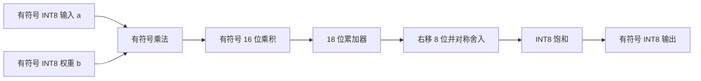

# INT8 乘加接口说明

> 更新时间：2026-09-08
>
> 本文是当前阶段的教学和验证规格，不是最终 CNN 的固定实现参数。
>
> 注意：本文由 AI 辅助生成，当前只作为参考草稿；在 Wong 独立推导、实现、运行并解释前，不作为个人掌握证据。

## 一、当前最小规格

本阶段先验证 4 项有符号 INT8 点积：

```text
acc = a[0]×b[0] + a[1]×b[1] + a[2]×b[2] + a[3]×b[3]
```

| 数据 | 位宽 | 有符号性 | 数值范围 | 说明 |
|---|---:|---|---|---|
| 输入 `a`、`b` | 8 位 | 有符号 | -128～127 | INT8 操作数 |
| 单次乘积 | 16 位 | 有符号 | -16256～16384 | 8 位乘 8 位 |
| 累加器 `acc` | 18 位 | 有符号 | -131072～131071 | 4 项乘积累加 |
| 移位后结果 | 计算值 | 有符号 | 由实际结果决定 | 右移 8 位并四舍五入 |
| 输出 `output_int8` | 8 位 | 有符号 | -128～127 | 超出范围时饱和 |

累加器位宽计算：

```text
PRODUCT_WIDTH = 2 × DATA_WIDTH = 16
ACC_WIDTH = PRODUCT_WIDTH + clog2(4) = 16 + 2 = 18
```

## 二、数据处理流程



## 三、溢出规则

### 3.1 累加器

当前 4 项点积的最大正值为：

```text
4 × (-128) × (-128) = 65536
```

最大负值为：

```text
4 × (-128) × 127 = -65024
```

两者都在 18 位有符号范围内，因此本阶段正常输入不会发生累加器溢出。Python 参考仍然保留二进制补码回绕函数 `wrap_signed`，方便后续增加并行项数时验证硬件位宽行为。

### 3.2 输出

移位后如果超过 INT8 范围，采用饱和而不是回绕：

```text
output = min(127, max(-128, shifted_value))
```

这样可以避免正数溢出后变成负数，也避免负数溢出后变成正数。

## 四、截断和舍入规则

当前把 18 位累加结果右移 8 位，作为从累加格式回到 INT8 输出格式的示例：

```text
shifted = round(acc / 2^8)
```

采用对称的远离零点四舍五入：

```text
acc >= 0：shifted = (acc + 2^7) >>> 8
acc <  0：shifted = -((-acc + 2^7) >>> 8)
```

这里的规则是当前教学规格。最终模型部署时，右移量应根据训练得到的 scale 和量化方案重新确定。

## 五、边界样例

### 正数边界

```text
a = [127, 127, 127, 127]
b = [127, 127, 127, 127]
acc = 64516
round(64516 / 256) = 252
饱和输出 = 127
```

### 负数边界

```text
a = [-128, -128, -128, -128]
b = [127, 127, 127, 127]
acc = -65024
round(-65024 / 256) = -254
饱和输出 = -128
```

## 六、验证证据

- Python 参考脚本：`D:\FPGA_Competition\verification\int8_mac_reference.py`；
- 固定随机种子：`20260907`；
- 样例数量：5 组边界/符号样例 + 20 组随机样例；
- 参考结果：`D:\FPGA_Competition\verification\sim_results\int8_mac_golden.json`；
- 下一步：用同一组输入和结果编写 `int8_mac.sv`，再进行 RTL 与 Python 逐项比对。

## 七、当前边界

- `ACC_WIDTH=18` 只适用于本阶段的 4 项点积示例；
- 最终 CNN 的卷积窗口、输入通道数和并行度确定后，需要重新计算累加器位宽；
- 当前输出饱和规则用于验证格式，不能直接当作最终模型的量化参数；
- Python 参考通过不等于 RTL 已通过，RTL 必须在下一阶段使用同一组黄金输入再次验证。

## 八、2026-09-08 共同学习与代运行记录

- Wong 已独立判断乘积极值，算出四项累加范围 -65024～65536，并判断 17 位不足；18 位足够。
- Wong 已解释 127 加一后补码变成 -128，完成舍入、饱和和逐项乘加的局部代码练习；AI 修正了负数舍入括号、Python 语法和函数调用。
- 当前偏置固定为 0，不接受非零偏置；输入与权重各为 4 个有符号 INT8 整数。输出同时保留精确累加值、18 位硬件累加值、舍入值及 INT8 饱和值。
- 输出缩放为除以 256：丢弃的是缩放后的分数精度，不是直接取累加器低 8 位。先取最近整数，恰好半整数时远离零，再饱和；不能在饱和判断前丢弃高位。
- 边界规则：8 位回绕 128→-128、-129→127；纯算术右移 300>>8→1、-300>>8→-2；本规格舍入 384→2、-384→-2；饱和 128→127、-129→-128。舍入不用 Python 内置 round 的偶数中点规则。
- 用户明确授权 AI 整理脚本并代运行。25 组黄金样例已生成，固定随机种子 20260907。独立 Decimal 算法遍历 -65024～65536 共 130561 个整数验证舍入与饱和；4 项测试全部通过。
- 测试脚本：`D:\FPGA_Competition\verification\test_int8_mac_reference.py`。
- 执行命令：`python -B -X utf8 D:\FPGA_Competition\verification\test_int8_mac_reference.py`。
- 这是共同实现与 AI 代运行证据，尚不等于 Wong 已独立重写、运行整份脚本；RTL 尚未验证。
